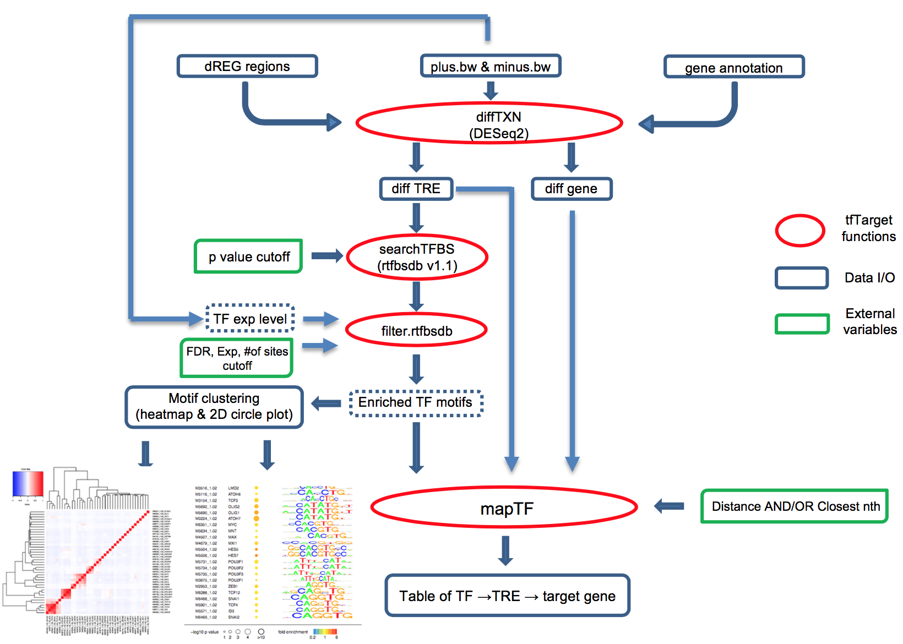

tfTarget
========

Transcription factors (TFs) regulate complex programs of gene transcription by binding to short DNA sequence motifs within transcription regulatory elements (TRE). Here we introduce tfTarget, a unified framework that identifies the "TF -> TRE -> target gene" networks that are differential regulated between two conditions, e.g. experimental vs. control, using PRO-seq/GRO-seq/ChRO-seq data as the input. The package provies a convenient interface for users without assuming knowledge with R environment, users can directly run the scipts in linux console. 

Cite tfTarget:
--------
Chromatin run-on and sequencing maps the transcriptional regulatory landscape of glioblastoma multiforme

Tinyi Chu, Edward J Rice, Gregory T Booth, Hans H Salamanca, Zhong Wang, Leighton J Core, Sharon L Longo, Robert J Corona, Lawrence S Chin, John T Lis, Hojoong Kwak, Charles Danko

Nature Genetics  https://www.nature.com/articles/s41588-018-0244-3

--------

A detailed example of running dREG and tfTarget from raw sequencing data can be found at https://doi.org/10.1002/cpbi.70 .


Workflow of tfTarget
--------



Requires
--------

* R packages:
	
	rphast, rtfbdbs, grid, cluster, apcluster, DESeq2, gplots.
	
	rtfbsdb (https://github.com/Danko-Lab/rtfbs_db) 
	
	bigWig  (https://github.com/andrelmartins/bigWig.git)

* bioinformatics tools or exterior command:
	
	awk, sort: Unix commands
	
	bedtools (http://bedtools.readthedocs.org/en/latest/)
	
	sort-bed (http://bedops.readthedocs.org/en/latest/index.html)
	
	twoBitToFa, faToTwoBit (http://hgdownload.cse.ucsc.edu/admin/exe/)

* 2bit files for your genome of interest.  Find links to these here: 
    
	http://hgdownload.cse.ucsc.edu/downloads.html
	
* tfs object file for the species of interests, in .rdata format, which contains the curated transcription factor motifs database. For Homo_sapiens, it is provided by tfTarget package, and will be used by default. For others species, we provide a convenient script get.tfs.R to call rtfbsdb, and generate the species.tfs.rdata. Please use `-tfs.path` to specify the tfs object file rather than Homo_sapiens when you call `run_tfTarget.bsh` 
	
	example: 
	```````
	R --vanilla --slave --args Mus_musculus < get.tfs.R
	
	R --vanilla --slave --args your_species your_cisbp_zip_file < get.tfs.R
	```````
	
	The look-up table for species name can be found here: 
	The "species" column (1st column) of  http://cisbp.ccbr.utoronto.ca/summary.php?by=1&orderby=Species

* TREs regions identified by dREG, or equivalent tools, in bed format. 

	To prepare the input TRE files, users are recommended to merge dREG sites from query and control samples, 
	using bedtools merge (http://bedtools.readthedocs.io/en/latest/content/tools/merge.html), e.g.,
        
	```````	
	cat query.dREG.peak.score.bed control.dREG.peak.score.bed \
	| LC_COLLATE=C sort -k1,1 -k2,2n \
	| bedtools merge -i stdin > merged.dREG.bed
	```````	

	Please notice to use `zcat` for bed.gz files.

* Gene annotation file in bed6 format. Can be prepared from gencode or Refseq gtf files. We recommend to use gene ID and gene name for the 4th and 5th columns. The information will show up in the output.
	https://www.gencodegenes.org/releases/current.html
	
	gtf.gz files can be converted to the gene annotation file for tfTarget input using the following command as an example:
        
	```````	
	zcat gencode.v19.annotation.gtf.gz \
	|  awk 'OFS="\t" {if ($3=="gene") {print $1,$4-1,$5,$10,$18,$7}}' \
	| tr -d '";' > gencode.v19.annotation.bed
	```````

	The following table illustrates the head of 'gencode.v19.annotation.bed', which includes chromosome, start, end position, gene id, gene name and strand. 

	```````
	chr1    11868   14412   ENSG00000223972.4       DDX11L1 +
	chr1    14362   29806   ENSG00000227232.4       WASH7P  -
	chr1    29553   31109   ENSG00000243485.2       MIR1302-11      +
	chr1    34553   36081   ENSG00000237613.2       FAM138A -
	chr1    52472   54936   ENSG00000268020.2       OR4G4P  +   
	chr1    62947   63887   ENSG00000240361.1       OR4G11P +
	chr1    69090   70008   ENSG00000186092.4       OR4F5   +
	chr1    89294   133566  ENSG00000238009.2       RP11-34P13.7   
	```````


* bigWigs files of query and control replicates. The same requirement for preparing the input files for dREG. 
	See this https://github.com/Danko-Lab/dREG#data-preparation

Installation
--------

* If all dependent packages and commands have been installed, please use the following codes to install/update the package in R terminal. 

```````
library("devtools");
install_github("Danko-Lab/tfTarget/tfTarget")
```````

If you want to run bash script (run_tfTarget.bsh), you have to download all files after the package is installed, Use the following command in UNIX/Linux terminal. 

```````
git clone https://github.com/Danko-Lab/tfTarget.git
cd tfTarget
```````


Usage
----------

To use the tfTarget package, after installing tfTarget package, simply run "bash run_tfTarget.bsh ... " under the directory of bash run_tfTarget.bsh and main.R, with ... specifying arguments for tfTarget detailed as below.

Required arguments: 

	-query: query file names of PRO-seq in bigWig format, ordered by plus and minus pairings, 
		e.g. query1.plus.bw query1.minus.bw query2.plus.bw query2.minus.bw ... 
		(The default directory is the current working directory, use -bigWig.path to specify if otherwise.)

	-control: control file names of PRO-seq in bigWig format, ordered by plus and minus pairings, 
		e.g. control1.plus.bw control1.minus.bw control2.plus.bw control2.minus.bw ...
		(The default directory is the current working directory, use -bigWig.path to specify if otherwise.)

	-prefix: prefix for the output pdfs and txts. 
	
	-TRE.path: input TRE regions, e.g. dREG sites, in bed3 format. Only the first three columns will be used. 
	
	-gene.path: Gene annotation file in bed6 format. Can be prepared from gencode or Refseq gtf files. 
		We recommend to use gene ID and gene name for the 4th and 5th columns. 
		The information will show up in the output. https://www.gencodegenes.org/releases/current.html
	
	-2bit.path: 2bit files for your genome of interest. 
		Find links to these here: http://hgdownload.cse.ucsc.edu/downloads.html


Optional arguments:

	Optional system arguments:
	-bigWig.path: path to the bigWig files. 
		Default="./"
	-ncores: number of threads to use. 
		Default=1.
	-deseq: Use this tag indicates to run DEseq2 only. 
		No arugment is required. Default is off.
	-rtfbsdb: Use this tag indicates to run DEseq2 and then rtfbsdb only. 
		No arugment is required. Default is off.
	
	Optional DEseq2 arguments:
	-pval.up: adjusted pvalue cutoff below which indicates differentially transcribed TREs. 
		Default=0.01.
	-pval.down: adjusted pvalue cutoff above which indicates TREs that are not significantly changed between query and control. 
		Default=0.1
	
	Optional rtfbsdb arguments:
	-tfs.path: use this tag to specify tfs object from non-Homo sapiens species. 
		Can be prepared using get.tfs.R. See the "requires" section above.
	-cycles: how many cycles to run GC-subsampled motif enrichment test. 
		Default=2.
	-mTH: threshold over which the TF motif is defined as significant different from the HMM background. 
		Default=7.
	-fdr.cutoff: cutoff of the median of pvalues from multiple GC-subsampled runs, above which defines significantly enriched motifs.
		Default=0.01	
	
	Optional mapTF arguments:	
	-dist: the distance cutoff (in base pair) for associating TRE to the nearest annotated transcriptional start site. 
		Default=50000.
	-closest.N: use this tag to report only the first nth genes to the TRE, can be used in combination with -dist. 
		Default is 2. To disable it, use "-closest.N off".
	-pval.gene: use this tag to report only genes that are significantly differentially transcribed genes 
		1) at the same direction as the regulator TRE, and 
		2) with adjusted pval lower than the cutoff specified. 
		Default is 0.05. To disable it, use "-pval.gene off".
	The default parameters were chosen based on the ChRO-seq paper "https://www.biorxiv.org/content/early/2018/05/13/185991".
	
	
	


Output
----------
	The output of an complete run of the main.R function will output .pdf files and .txt files.
	
	Specifically,
	1) .cor.heatmap.pdfs for TF motifs clustered by genomic locations,
	2) .motif.ordered.pdfs for the visualization of TF motifs and their enrichment statistics
	   ordered by clusters in 1).
	3) .TRE.deseq.txt for each TREs and their DESeq2 statistics.
	4) .gene.deseq.txt for each annotated gene body and their DESeq2 statistics.
	   Rows with all NA value means that the length of gene is too short (<=1Kb) to be included for DESeq2 runs.
	5) .TF.TRE.gene.txt for each TF whose motif is enriched in up/down TREs, 
	   and the TREs that contains the motif, and the putative target genes for the TRE.
	   We recommend users to further filter the target genes of log2foldchange (and the pvalues) 
	   with the same direction of change as the TRE by which it is regulated.
	

Documents
----------

* R vignette:
 (Coming soon)

* R manual:
 (Coming soon)

